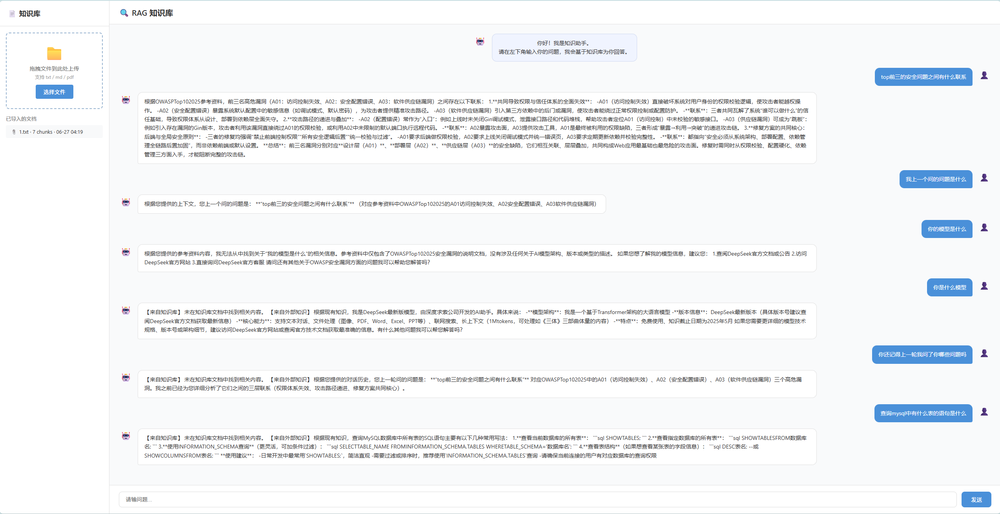
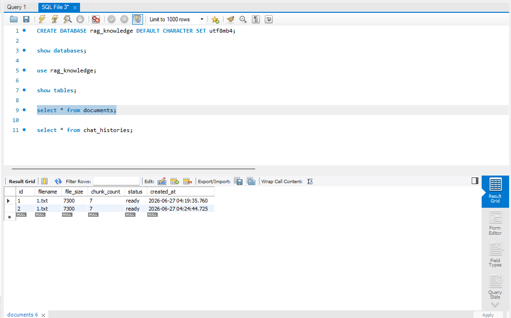
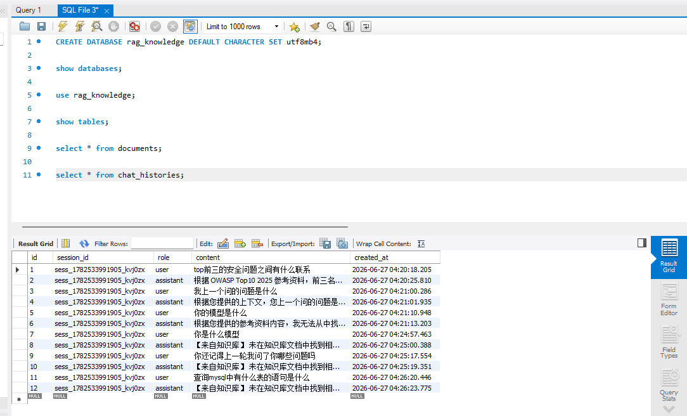
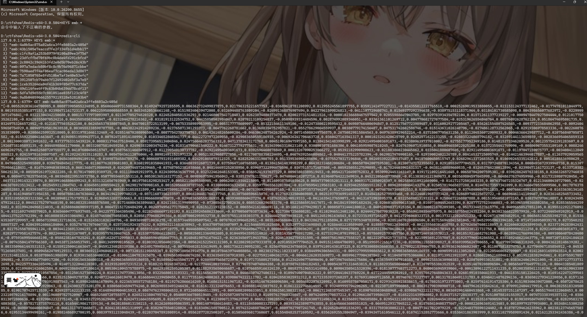

# RAG Knowledge Base - 知识库问答系统

基于 Go 语言从零实现的 RAG（检索增强生成）知识库系统，支持文档导入、向量检索、多轮对话、Redis 缓存与 MySQL 持久化。

## ✨ 功能

- **多格式文档导入**：支持 TXT、Markdown、PDF 文件，拖拽上传自动入库
- **智能文本切分**：固定长度切分 + overlap 重叠窗口（中文友好）
- **向量化存储与检索**：硅基流动 Embedding API + 余弦相似度 TopK 召回
- **Redis 缓存**：Embedding 向量缓存，重复查询 1ms 返回，降级策略保障服务
- **多轮对话记忆**：Session 级别对话历史，LLM 感知上下文
- **SSE 流式问答**：DeepSeek API 流式调用，前端逐字显示
- **知识库面板**：左侧实时展示已导入文档（文件名 · chunk 数 · 导入时间）
- **MySQL 持久化**：文档元数据 + 对话历史落盘，重启数据不丢失
- **YAML 配置管理**：统一 config.yaml，消除硬编码

## 🖼️ 界面预览

### 1. Web 对话界面


### 2. MySQL 数据库（文档表 + 对话历史表）



### 3. Redis 缓存（Embedding 向量缓存）


## 📁 项目结构

```
rag_knowledge/
├── main.go                     # 入口：加载配置 → 初始化 MySQL/Redis → 启动 Web
├── go.mod
├── config.yaml                 # 配置文件（端口、数据库、Redis、模型参数）
├── config/
│   └── config.go               # 配置解析（yaml → struct）
├── uploads/                    # 用户上传文档存放目录
│   ├── 1.txt
│   └── example.pdf
├── web/                        # 前端资源
│   ├── templates/
│   │   └── index.html          # 分栏式聊天界面
│   └── static/
│       └── style.css           # 页面样式
└── internal/
    ├── chunker/
    │   └── chunker.go           # 文本切分（Chunk）
    ├── embedder/
    │   ├── embedder.go          # Embedding API 调用
    │   └── cache.go             # Redis 缓存层（带降级）
    ├── llm/
    │   └── llm.go               # DeepSeek API 调用（单轮 / 多轮）
    ├── store/
    │   └── store.go             # 向量存储 + 余弦相似度检索
    ├── rag/
    │   └── rag.go               # RAG 核心流程（ImportDoc + Ask）
    ├── uploads/
    │   └── upload.go            # 文件类型识别 + 文本提取（txt/md/pdf）
    ├── database/
    │   ├── db.go                # GORM 初始化 + CRUD
    │   └── models.go            # Document / ChatHistory 模型
    └── api/
        ├── router.go            # Gin 路由注册 + 静态文件
        └── handler/
            ├── upload.go        # POST /api/upload     - 文件上传
            ├── chat.go          # GET  /api/chat/stream - SSE 流式问答（多轮）
            └── scanfile.go      # GET  /api/file        - 已导入文件列表
```

## 🔄 数据流

```
浏览器 ──HTTP──→ Gin Server ──→ RAG 核心模块 ──→ DeepSeek / 硅基流动 API
   │                 │
   │                 ├──→ MySQL（文档元数据 + 对话历史）
   │                 └──→ Redis（Embedding 缓存）
   │
   └── SSE 流式接收回答 ←──────────────────────┘

问答流程：
  用户提问 → Redis 缓存? → Embedding API → 向量检索(TopK=5)
  → MySQL 查历史对话 → 拼 Messages → LLM 流式回答
  → SSE 逐字推送前端 → MySQL 存回答

文档导入流程：
  拖拽文件 → 保存到 uploads/ → 提取纯文本 → 切分 Chunk
  → Embedding（走 Redis 缓存）→ 存入向量库 → MySQL 记录元数据
```

## 🔌 API 接口

| 方法   | 路径                | 说明           | 关键参数                          |
| ------ | ------------------- | -------------- | --------------------------------- |
| `GET`  | `/`                 | 首页           | -                                 |
| `POST` | `/api/upload`       | 文件上传       | multipart form `file`             |
| `GET`  | `/api/chat/stream`  | SSE 流式问答   | `q` (问题), `session_id` (会话ID) |
| `GET`  | `/api/file`         | 已导入文件列表 | -                                 |
| `GET`  | `/static/*filepath` | 静态资源       | -                                 |

## 🚀 快速开始

### 环境要求

- Go 1.26+
- MySQL 8.0+
- Redis（本地运行）
- DeepSeek API Key（LLM 调用）
- 硅基流动 API Key（Embedding 调用）

### 前置准备

```bash
# 1. 启动 MySQL，创建数据库
mysql -u root -p
CREATE DATABASE rag_knowledge DEFAULT CHARACTER SET utf8mb4;

# 2. 启动 Redis（另开终端）
redis-server
```

### 安装

```bash
git clone <your-repo-url>
cd rag_knowledge
go mod tidy
```

### 配置

编辑 `config.yaml` 填入你的 MySQL、Redis、LLM 参数。

```bash
# API Key 通过环境变量设置
export DEEPSEEK_API_KEY="your-deepseek-api-key"
export SILICONFLOW_API_KEY="your-siliconflow-api-key"

# Windows (PowerShell)
$env:DEEPSEEK_API_KEY="your-deepseek-api-key"
$env:SILICONFLOW_API_KEY="your-siliconflow-api-key"
```

### 运行

```bash
go run .
# 浏览器打开 http://localhost:8088
```

## 📦 模块说明

| 模块       | 职责                | 关键函数                                                               |
| ---------- | ------------------- | ---------------------------------------------------------------------- |
| `chunker`  | 文本切分            | `SplitText(text, chunkSize, overlap)`                                  |
| `embedder` | 向量化 + Redis 缓存 | `GetEmbedding()`, `EmbedWithCache()`, `InitRedis()`                    |
| `store`    | 向量存储与检索      | `Add()`, `Search()`, `CosineSimilarity()`                              |
| `llm`      | DeepSeek API 调用   | `CallDeepseekAPI()`, `CallDeepseekAPIHistory()`, `dorequest()`         |
| `rag`      | RAG 核心流程        | `ImportDoc()`, `Ask()`, `AskThreeSteps()`                              |
| `uploads`  | 文件解析            | `DetectType()`, `ExtractText()`, `ProcessFile()`                       |
| `database` | MySQL 持久化        | `InitDB()`, `CreateDocument()`, `SaveMessage()`, `GetSessionHistory()` |
| `api`      | HTTP 层 + 路由      | `Setup()`, `UploadHandler()`, `ChatStream()`, `ScanFile()`             |
| `config`   | 配置管理            | `Load()`, `Cfg` 全局实例                                               |

## 🛠 技术选型

| 组件           | 选择                        | 说明                                   |
| -------------- | --------------------------- | -------------------------------------- |
| Embedding 模型 | BAAI/bge-large-zh-v1.5      | 硅基流动 API，中文效果好               |
| LLM            | DeepSeek-Chat               | 流式输出，支持多轮对话                 |
| Web 框架       | Gin                         | 轻量高性能，Go 生态主流                |
| 流式传输       | SSE (Server-Sent Events)    | 前端 EventSource 原生支持              |
| 数据库         | MySQL 8.0 + GORM            | 持久化文档元数据与对话历史             |
| 缓存           | Redis                       | Embedding 向量缓存，降级策略保障高可用 |
| 向量存储       | 内存切片（`[]VectorChunk`） | 当前规模适用，可平滑扩展 Qdrant/Milvus |
| PDF 解析       | ledongthuc/pdf              | 纯 Go 实现，零 CGo 依赖                |
| 前端           | 原生 HTML/CSS/JS            | 零框架依赖                             |
| 配置           | YAML + struct               | 消除硬编码，统一管理                   |

## 📋 版本规划

- **V1** ✅ 核心 RAG 链路（命令行版）
- **V2** ✅ Gin Web 服务 + 分栏前端 + SSE 流式问答 + 拖拽上传
- **V3** ✅ 多轮对话记忆 + MySQL 持久化 + Redis Embedding 缓存 + 配置管理
- **V4** 🚧 Eino 框架重构（对比手动实现）
- **V5** 🚧 混合检索（BM25 + 向量检索）+ Rerank

## 📄 License

MIT
